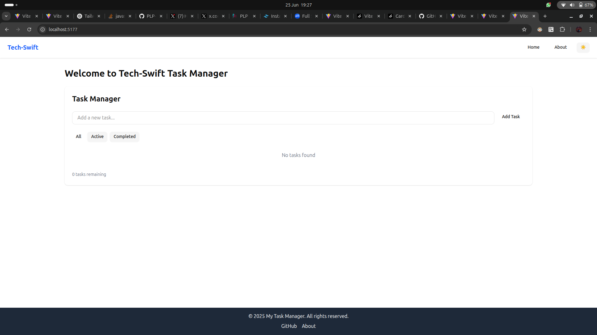
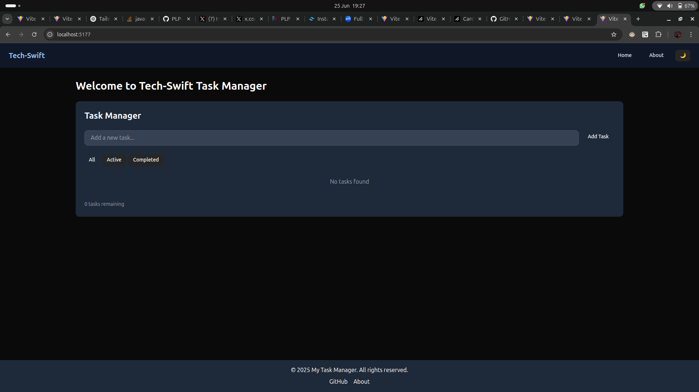
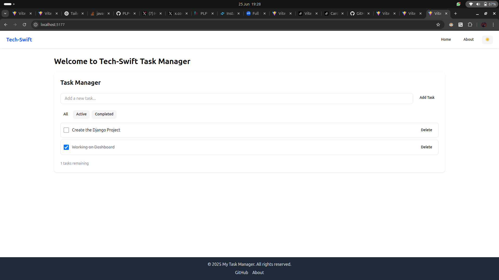
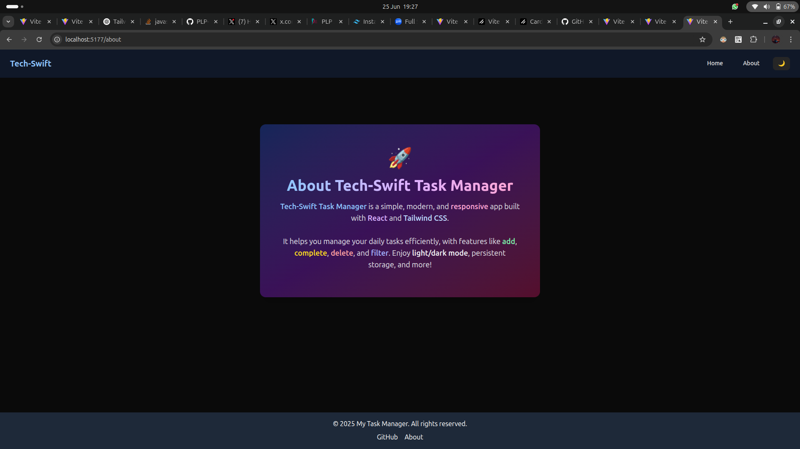

# Tech-Swift Task Manager

## Deployed Link

The app is live on GitHub Pages:
https://plp-mern-stack-development.github.io/week-3-react-js-assignment-Tech-Swift/

A modern, vibrant, and responsive task management app built with **React**, **Vite**, and **Tailwind CSS**.

## 🚀 Features
- Add, complete, delete, and filter tasks
- Tasks persist in your browser (localStorage)
- Latest tasks appear at the top; completed tasks are pushed to the bottom
- Light/Dark mode with a theme switcher
- Reusable UI components (Button, Card, Navbar, Footer, Layout)
- API integration (fetch, search, paginate public data)
- Responsive design for mobile, tablet, and desktop
- Beautiful, animated UI with Tailwind CSS

## 📸 Screenshots

| Home (Light) | Home (Dark) |
|:---:|:---:|
|  |  |

| Task Added | About (Dark) |
|:---:|:---:|
|  |  |

## 🛠️ Tech Stack
- [React](https://react.dev/)
- [Vite](https://vitejs.dev/)
- [Tailwind CSS](https://tailwindcss.com/)
- [React Router](https://reactrouter.com/)

## 📦 Getting Started

### Prerequisites
- Node.js v18 or higher
- pnpm (recommended) or npm

### Setup
1. **Clone the repository:**
   ```sh
   git clone <your-repo-url>
   cd week-3-react-js-assignment-Tech-Swift
   ```
2. **Install dependencies:**
   ```sh
   pnpm install
   # or
   npm install
   ```
3. **Start the development server:**
   ```sh
   pnpm run dev
   # or
   npm run dev
   ```
4. **Open your browser:**
   Visit the local address shown in the terminal (e.g., http://localhost:5173)

## 📝 Usage
- **Add a task:** Type in the input and click "Add Task"
- **Complete a task:** Click the checkbox next to a task
- **Delete a task:** Click the "Delete" button
- **Filter tasks:** Use the filter buttons (All, Active, Completed)
- **Switch theme:** Use the ☀️/🌙 button in the Navbar
- **API Demo:** Visit the API integration page (if available) to see public data fetching, search, and pagination

## 🌐 Deployment
You can deploy this app for free using:
- [Vercel](https://vercel.com/)
- [Netlify](https://www.netlify.com/)
- [GitHub Pages](https://pages.github.com/)

## 📄 Assignment Notes
- All requirements from the assignment have been implemented
- Code is clean, modular, and follows React best practices
- See [Week3-Assignment.md](./Week3-Assignment.md) for the original instructions

## 👤 Author
- Tech Swift
- [Ticha23](https://github.com/Ticha23)

---

Feel free to open issues or submit pull requests for improvements!
